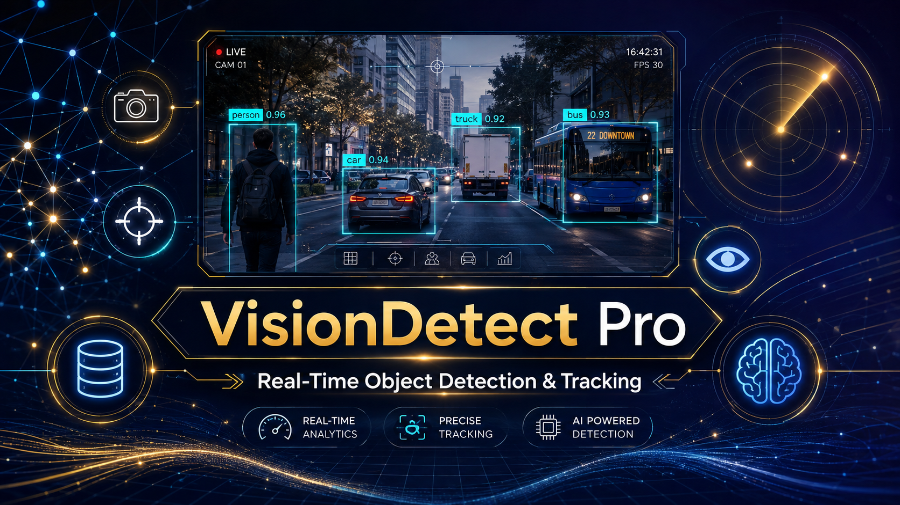
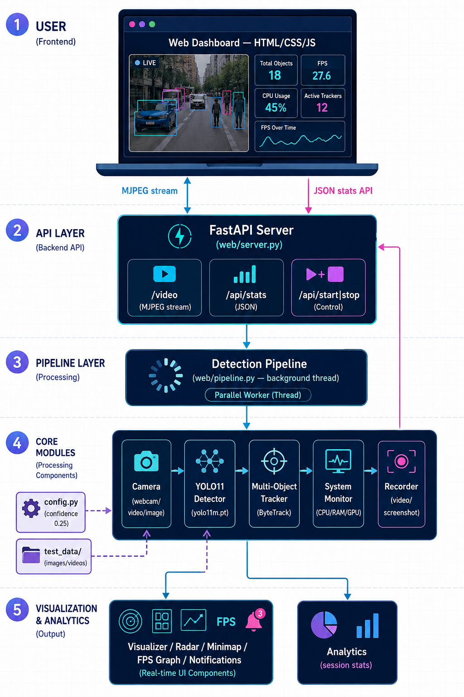
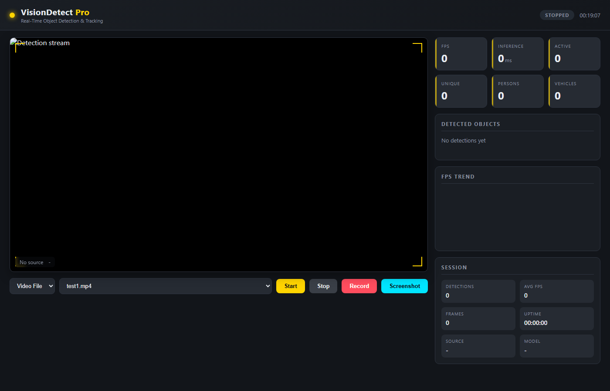
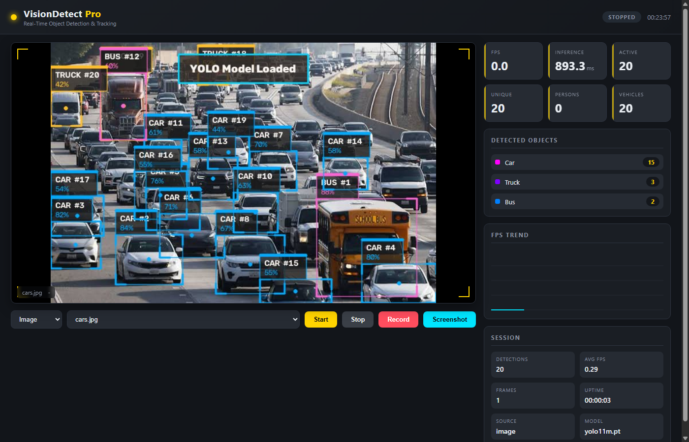
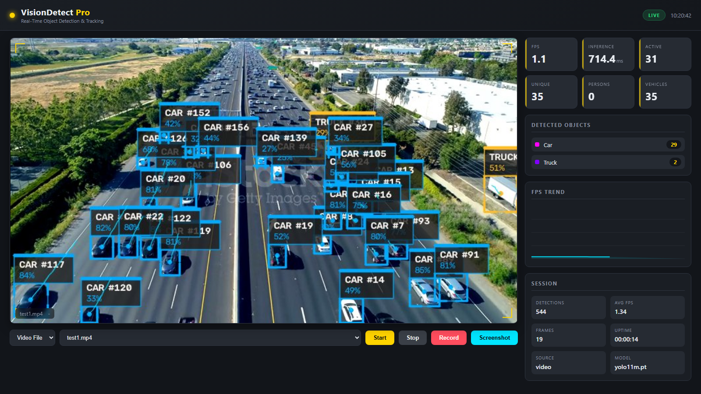

# 🚀 VisionDetect Pro — Real-Time Object Detection, Multi-Object Tracking & Analytics System

<p align="center">
  
</p>


<h3 align="center">
YOLO11 Object Detection & ByteTrack Multi-Object Tracking with Web Dashboard
</h3>


<p align="center">


</p>


---


A modular real-time computer vision application built with **Python**, **OpenCV**, **Ultralytics YOLO11**, and **ByteTrack**.


The platform performs accurate object detection, persistent multi-object tracking, live analytics, professional visualization, screenshot capture, and video recording through a modern dashboard interface, while a FastAPI-powered web dashboard streams annotated video and real-time statistics to any browser.


---


# 📌 Overview


Real-time object detection and tracking is fundamental to modern computer vision systems used in security, traffic, retail, and industrial monitoring.


Typical applications include:


* 🛡 Security and surveillance
* 🚦 Traffic monitoring and counting
* 🏬 Retail analytics and people flow
* 🏭 Industrial and warehouse inspection
* 🎥 Video analytics and logging
* 🚶 Crowd and activity monitoring


Traditional computer vision development is challenging because of:


* Real-time performance requirements
* Hardware and GPU availability constraints
* Variable lighting and camera conditions
* Persistent identity tracking across frames
* Complex visualization of results


This project automates the complete workflow using pretrained YOLO11 detection, ByteTrack multi-object tracking, and a real-time web dashboard that streams results to any browser.


---


# 🚀 Key Features


| Feature                                | Status |
| -------------------------------------- | :----: |
| Real-Time Object Detection             |    ✅   |
| Multi-Object Tracking                  |    ✅   |
| Motion Trails                          |    ✅   |
| FPS Monitoring                         |    ✅   |
| System Monitoring (CPU / RAM / GPU)    |    ✅   |
| Performance Alerts                     |    ✅   |
| Screenshot Capture                     |    ✅   |
| Video Recording                        |    ✅   |
| Web Dashboard (FastAPI)                |    ✅   |


---


# 🏗️ System Architecture


<p align="center">
  
</p>


The platform is organised into three primary layers:


* **Frontend Layer** — FastAPI-served web dashboard (HTML / CSS / JS) for live streaming and controls.
* **Backend Layer** — FastAPI REST API responsible for video streaming, statistics and session controls.
* **AI Processing Layer** — Executes YOLO11 detection and ByteTrack tracking on image, video and webcam sources.


---


# 🌐 Frontend Layer


### Technology Stack


* HTML5
* CSS3
* Vanilla JavaScript
* FastAPI Static File Serving


### Responsibilities


* Live MJPEG video stream display
* Source picker (webcam / video / image)
* Start / Stop / Record / Screenshot controls
* Detected-object breakdown
* FPS trend chart
* System monitoring indicators


---


# ⚙️ Backend Layer


### Technology Stack


* FastAPI
* Uvicorn
* NumPy
* Python


### Responsibilities


* REST API management
* Live MJPEG video streaming
* Real-time statistics API
* Background detection pipeline
* Static file serving
* Session controls


---


# 🤖 AI Processing Layer


The complete AI workflow is performed using pretrained deep learning models.


```text
Select Source (webcam / video / image)
          │
          ▼
Frame Processing
          │
          ▼
YOLO11 Object Detection
          │
          ▼
ByteTrack Multi-Object Tracking
          │
          ▼
Visualization & Overlays
          │
          ▼
Analytics & System Monitoring
          │
          ▼
Live Stream & Controls (Web Dashboard)
```


For **recording**, the workflow instead begins by capturing frames to disk while detection continues:


```text
Detection & Tracking Loop
          │
          ▼
Screenshot Capture ──► output/screenshots/
          │
          ▼
Video Recording ──────► output/videos/
```


---


# 🤖 AI Models


The project performs **AI inference only**.


No model training or dataset preparation is included. The application uses pretrained models for prediction and tracking.


---


# 🎯 YOLO11 (Object Detection)


**YOLO11** is a state-of-the-art pretrained object detection model from Ultralytics.


### Purpose


Detect objects in every frame in real time.


### Supported Sources


* Webcam
* Video files
* Images
* Folders


### Output


* Bounding boxes with class labels
* Confidence scores
* Detected-object breakdown


---


# 👣 ByteTrack (Multi-Object Tracking)


**ByteTrack** is a pretrained multi-object tracking algorithm that assigns persistent IDs to detections.


### Purpose


Keep track of each object across frames.


### Output


* Persistent tracking IDs
* Motion trajectories
* Active object counting


---


# 📸 Screenshots


## 🖥️ Web Dashboard — Idle


<p align="center">

</p>


---


## 🖥️ Web Dashboard — Image Detection


<p align="center">

</p>


---


## 🖥️ Web Dashboard — Video Tracking


<p align="center">

</p>


---


# ✨ Features


## 🎯 Object Detection


The system performs real-time YOLO11 object detection.


**Capabilities:**


* Real-time YOLO11 object detection
* Image, video and webcam support
* Confidence threshold filtering
* Multiple object classes


---


## 👣 Multi-Object Tracking


The system tracks every detected object across frames.


**Capabilities:**


* ByteTrack integration
* Persistent tracking IDs
* Motion trajectories
* Active object counting


---


## 🎨 Professional Visualization


The system draws modern, compact overlays on the annotated stream.


* Modern bounding boxes
* Compact labels
* Motion trails
* Recording indicator
* FPS graph
* Radar view
* MiniMap
* Notifications


---


## 🖥️ Web Dashboard


A browser-based dashboard streams the live result.


* FastAPI + HTML/CSS/JS browser interface
* Live MJPEG video stream
* Real-time statistics API
* Source picker (webcam / video / image)
* Start / Stop / Record / Screenshot controls
* Detected-object breakdown and FPS trend chart


---


## 🎥 Recording


* Video recording
* Screenshot capture
* Recording notifications


---


## 📈 Analytics


* FPS monitoring
* Session statistics
* Detection statistics
* Performance monitoring


---


## 🖥️ System Monitoring


* CPU usage
* RAM usage
* GPU name, utilization and memory (NVIDIA)
* Session uptime
* Low FPS / high CPU alerts


---


# 📂 Project Structure


```text
VisionDetect-Pro/
│
├── assets/
│   ├── thumbnail.png
│   ├── architecture.png
│   ├── web_dashboard_image.png
│   ├── web_dashboard_video.png
│   └── web_dashboard_idle.png
│
├── models/
│
├── output/
│   ├── screenshots/
│   └── videos/
│
├── src/
│   ├── core/               # Detection, camera, recorder
│   ├── tracking/           # Multi-object tracking
│   ├── monitor/            # CPU / RAM / GPU system monitor
│   ├── ui/                 # Visualizer, radar, minimap, graphs, notifier
│   └── utils/              # Config, analytics
│
├── test_data/
│
├── web/
│   ├── pipeline.py          # Headless detection pipeline (background thread)
│   ├── server.py            # FastAPI server (stream, stats, controls)
│   └── static/              # HTML / CSS / JS dashboard
│
├── run_web.py
├── requirements.txt
└── README.md
```


---


# 🔌 Backend API Endpoints


| Endpoint         | Method | Purpose                              |
| ---------------- | ------ | ------------------------------------ |
| `/`              | GET    | Serve the web dashboard              |
| `/video`         | GET    | Live MJPEG video stream              |
| `/api/stats`     | GET    | Real-time statistics API             |
| `/api/start`     | POST   | Start the detection pipeline         |
| `/api/stop`      | POST   | Stop the detection pipeline          |
| `/api/record`    | POST   | Start / stop video recording         |
| `/api/screenshot`| POST   | Capture a screenshot                 |


---


# 💻 Installation


## Clone Repository


```bash
git clone https://github.com/huzaifa-ai-tech/VisionDetect-Pro.git


cd VisionDetect-Pro
```


---


## Backend Setup


Create a virtual environment:


```bash
python -m venv venv
```


Activate the environment.


**Windows**


```bash
venv\Scripts\activate
```


**Linux / macOS**


```bash
source venv/bin/activate
```


Install dependencies:


```bash
pip install -r requirements.txt
```


---


## ▶ Usage


Launch the browser-based dashboard (FastAPI + HTML/JS):


```bash
python run_web.py
```


Open `http://127.0.0.1:8000` in your browser.


| Option | Description |
| ------ | ----------- |
| `--host` | Bind host (default: `127.0.0.1`) |
| `--port` | Bind port (default: `8000`) |
| `--reload` | Enable auto-reload for development |


The web dashboard provides a live MJPEG video stream, a real-time statistics API, a source picker (webcam / video / image), and Start / Stop / Record / Screenshot controls.


---


# 📊 Generated Outputs


The system automatically generates multiple outputs after each session.


## 🎥 Recordings


* Video recordings saved to `output/videos/`
* Screenshot captures saved to `output/screenshots/`


---


## 📈 Analytics


* FPS trend data
* Session statistics
* Detected-object breakdown


---


## 🖥️ System Metrics


* CPU / RAM / GPU utilization
* Performance alerts


---


# 🛠️ Technologies Used


## 🤖 Artificial Intelligence


* Ultralytics YOLO11
* ByteTrack


---


## 👁️ Computer Vision


* OpenCV


---


## 🖥️ System Monitoring


* psutil (CPU / RAM)
* nvidia-ml-py (GPU)


---


## ⚙️ Backend


* Python
* NumPy
* FastAPI / Uvicorn (web dashboard)


---


# ⚡ Advantages


* Real-time detection and tracking in a single application
* Browser-based web dashboard with live video streaming
* Motion trails, radar view and minimap visualization
* Automatic GPU acceleration when available
* Built-in screenshot and recording controls
* Clean modular architecture easy to extend
* Works with webcam, image, video and folder inputs


---


# ⚠️ Limitations


* Performance depends on hardware and GPU availability
* Tracking quality depends on camera and lighting conditions
* YOLO model download required on first run


---


# 🔮 Future Improvements


Planned enhancements include:


* GPU acceleration
* ONNX / TensorRT support
* Face recognition
* License plate recognition
* Crowd density estimation
* Heatmap analytics
* WebSocket live streaming


---


# 👨‍💻 Author


**Huzaifa**


GitHub:
https://github.com/huzaifa-ai-tech


---


# 🙏 Acknowledgements


This project is built using several outstanding open-source technologies:


* [Ultralytics YOLO11](https://github.com/ultralytics/ultralytics) — Real-time object detection
* [OpenCV](https://opencv.org/) — Computer vision and image processing
* [ByteTrack](https://github.com/ifzhang/ByteTrack) — Multi-object tracking
* [FastAPI](https://fastapi.tiangolo.com/) — Web dashboard backend
* [NumPy](https://numpy.org/) — Numerical computing
* [Python](https://www.python.org/) — Core programming language


Special thanks to the open-source community for providing these powerful tools and frameworks that made this project possible.


---


# ⚠️ Disclaimer


This project is developed for educational purposes.


Detection and tracking results may vary depending on hardware, camera quality, and environmental conditions. Performance is not guaranteed in production environments.


---


# ⭐ Support


If you found this project useful, please consider giving it a **⭐ Star** on GitHub.


Your support helps improve the project and motivates future development.
